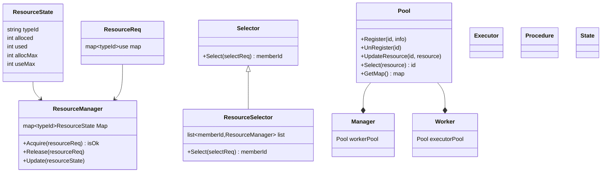

# Potatos 模块构思

```mermaid
classDiagram
class ResourceState{
    string typeId
    int alloced
    int used
    int allocMax
    int useMax
}

class ResourceReq{
    map~typeId~use map
}

class ResourceManager{
    map~typeId~ResourceState Map 
    +Acquire(resourceReq) isOk
    +Release(resourceReq)
    +Update(resourceState)
}

ResourceState --> ResourceManager
ResourceReq --> ResourceManager

class Selector{
    +Select(selectReq) memberId
}

class ResourceSelector{
    list~memberId,ResourceManager~ list
    +Select(selectReq) memberId
}

Selector <|-- ResourceSelector

class Pool{
    +Register(id, info)
    +UnRegister(id)
    +UpdateResource(id, resource)
    +Select(resource) id
    +GetMap() map
}

class Manager{
    Pool workerPool
}

class Worker{
    Pool executorPool
}

class Executor{
    
}

Pool --* Manager
Pool --* Worker


class Procedure
class State


```

